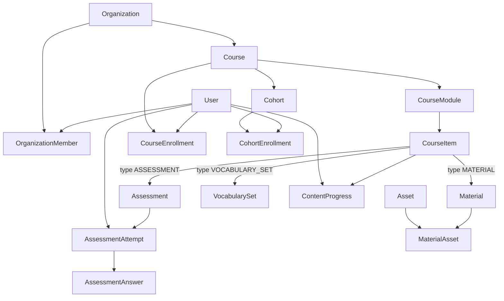
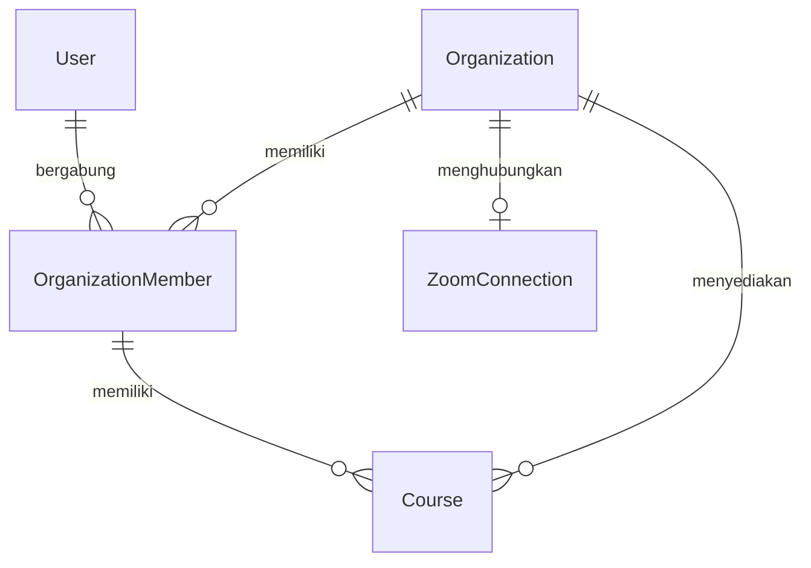
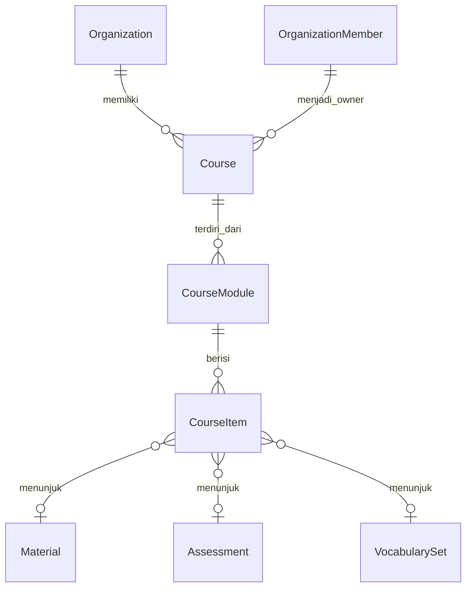
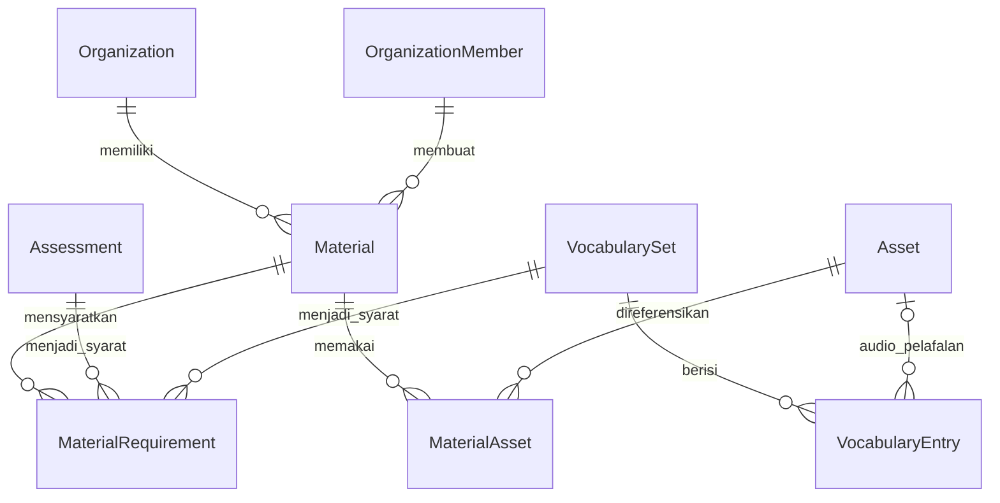
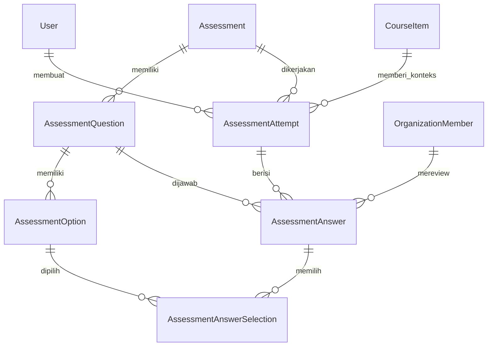
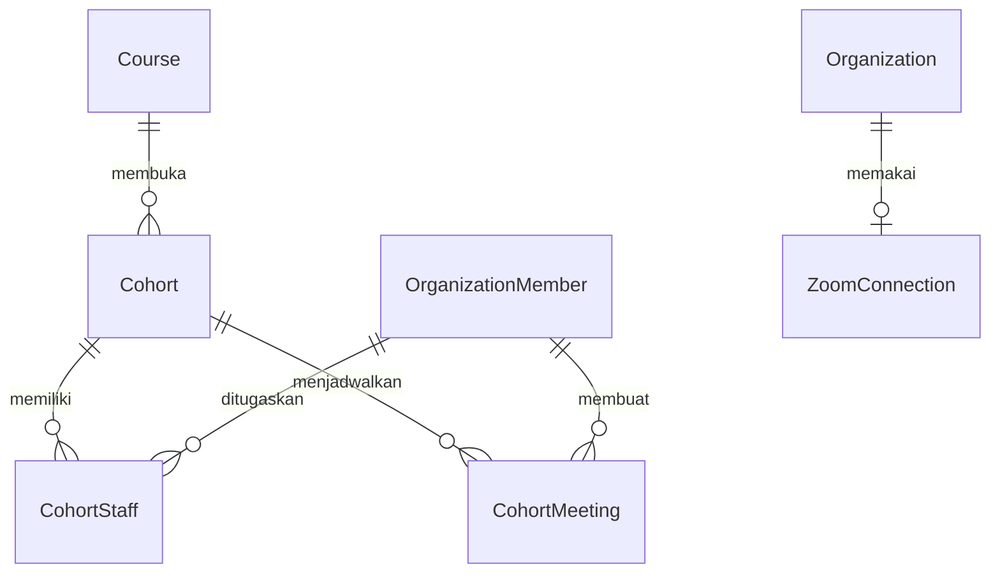
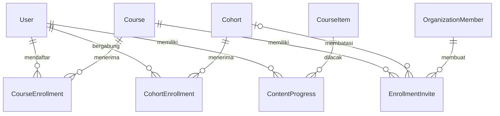
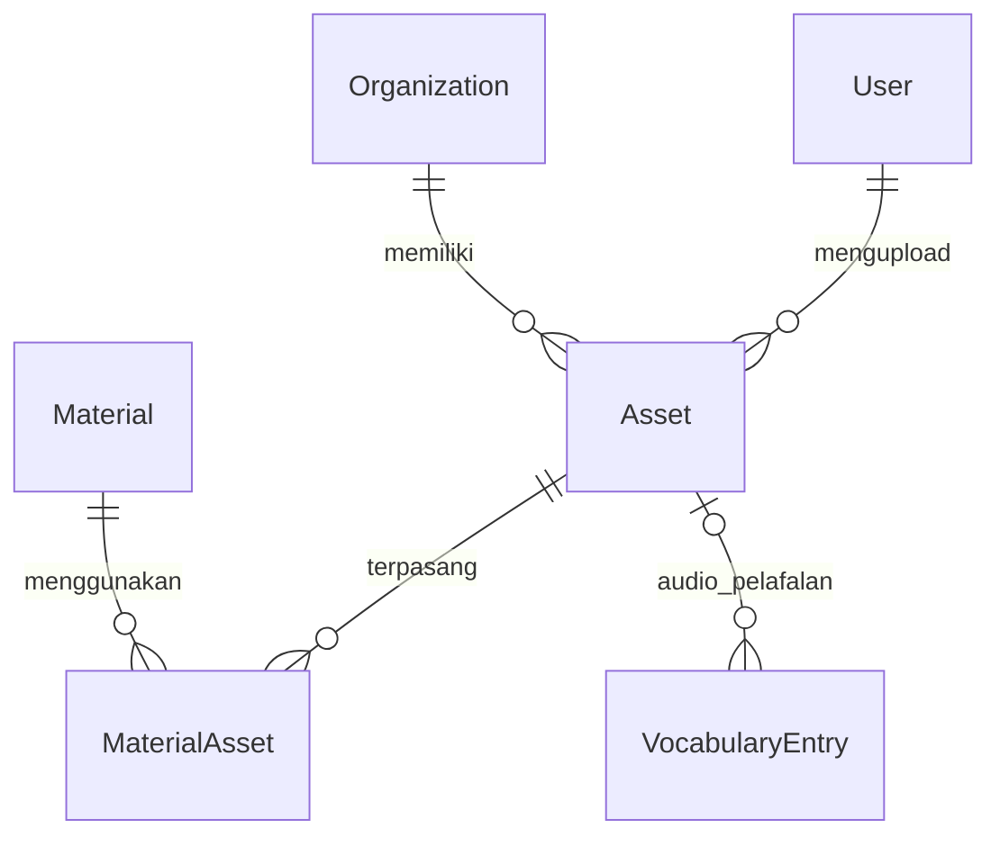

# Dokumentasi Database Hakgyo V2

Dokumen ini menjelaskan struktur database Hakgyo V2 berdasarkan
[`apps/web/prisma/schema.prisma`](../apps/web/prisma/schema.prisma). Tujuannya
adalah membantu developer memahami fungsi setiap tabel, hubungan antartabel,
dan alur data utama tanpa harus membaca seluruh Prisma schema.

## Ringkasan

Hakgyo menggunakan PostgreSQL dan Prisma. Database dibagi menjadi tujuh domain:

| Domain             | Tabel utama                                                                                                                  | Fungsi                                                |
| ------------------ | ---------------------------------------------------------------------------------------------------------------------------- | ----------------------------------------------------- |
| Autentikasi        | `User`, `Session`, `Account`, `Verification`                                                                                 | Login, akun OAuth/password, dan sesi pengguna         |
| Organisasi         | `Organization`, `OrganizationMember`                                                                                         | Multi-tenant dan role anggota                         |
| Course             | `Course`, `CourseModule`, `CourseItem`                                                                                       | Struktur kurikulum dan urutan konten                  |
| Cohort             | `Cohort`, `CohortStaff`, `CohortMeeting`, `ZoomConnection`                                                                   | Kelas berbasis batch dan live meeting                 |
| Materi             | `Material`, `VocabularySet`, `VocabularyEntry`, `MaterialRequirement`                                                        | Materi BlockNote, kosakata, dan syarat penyelesaian   |
| Assessment         | `Assessment`, `AssessmentQuestion`, `AssessmentOption`, `AssessmentAttempt`, `AssessmentAnswer`, `AssessmentAnswerSelection` | Quiz, pengerjaan, penilaian otomatis, dan review guru |
| Akses dan progress | `CourseEnrollment`, `CohortEnrollment`, `EnrollmentInvite`, `ContentProgress`                                                | Pendaftaran, undangan, dan kemajuan belajar           |
| File               | `Asset`, `MaterialAsset`                                                                                                     | Metadata file R2 dan keterkaitannya dengan materi     |

## Gambaran Besar



Alur hierarki konten:

```text
Organization
  -> Course
    -> CourseModule
      -> CourseItem
        -> Material | Assessment | VocabularySet
```

`CourseItem` adalah penghubung antara struktur course dan resource pembelajaran.
Resource seperti materi, assessment, dan vocabulary disimpan terpisah agar bisa
digunakan kembali di lebih dari satu course.

## Konsep Multi-Tenant

Satu `User` dapat menjadi anggota beberapa `Organization` melalui
`OrganizationMember`.



### Organization

Mewakili sekolah, lembaga kursus, atau tenant.

Field penting:

| Field                   | Keterangan                                          |
| ----------------------- | --------------------------------------------------- |
| `slug`                  | Identifier URL yang unik                            |
| `defaultEnrollmentMode` | Default akses course: terbuka atau melalui undangan |

### OrganizationMember

Menghubungkan user dengan organisasi dan menyimpan role di organisasi tersebut.

| Role      | Kegunaan                     |
| --------- | ---------------------------- |
| `OWNER`   | Pemilik organisasi           |
| `ADMIN`   | Mengelola organisasi         |
| `TEACHER` | Membuat atau mengajar konten |

Satu user hanya boleh memiliki satu membership dalam organisasi yang sama.
Relasi creator dan owner menggunakan `OrganizationMember`, bukan langsung
`User`, agar role dan organisasi pembuat selalu jelas.

## Course dan Struktur Konten



### Course

Produk pembelajaran utama, misalnya `Korean Beginner 1`.

Field penting:

| Field               | Keterangan                                             |
| ------------------- | ------------------------------------------------------ |
| `ownerMembershipId` | Anggota organisasi yang bertanggung jawab atas course  |
| `slug`              | Unik di dalam organisasi                               |
| `price`, `currency` | Harga publikasi; payment belum dimodelkan              |
| `enrollmentMode`    | Override aturan enrollment organisasi, jika diperlukan |
| `status`            | `DRAFT`, `PUBLISHED`, atau `ARCHIVED`                  |

### CourseModule

Pengelompokan materi dalam course, misalnya `Hangul Dasar` atau `Perkenalan`.
Urutan module disimpan pada `position` dan harus unik dalam satu course.

### CourseItem

Item berurutan di dalam module. Setiap row wajib menunjuk tepat ke satu resource:

| `type`           | Target yang wajib terisi |
| ---------------- | ------------------------ |
| `MATERIAL`       | `materialId`             |
| `ASSESSMENT`     | `assessmentId`           |
| `VOCABULARY_SET` | `vocabularySetId`        |

`isPublished` menentukan apakah item sudah dapat ditampilkan kepada learner.
Kombinasi `moduleId` dan `position` bersifat unik.

## Materi Pembelajaran



### Material

Halaman pembelajaran berbasis BlockNote.

| Field                 | Keterangan                                                 |
| --------------------- | ---------------------------------------------------------- |
| `content`             | JSON dokumen BlockNote                                     |
| `editorSchemaVersion` | Versi struktur JSON untuk kebutuhan migrasi editor         |
| `requirementPolicy`   | `ALL` jika semua syarat wajib, `ANY` jika cukup salah satu |

Contoh penggunaan untuk bahasa Korea:

- Penjelasan tata bahasa `은/는`
- Materi Hangul dengan gambar dan audio
- Dialog situasional dengan file audio
- Reading passage dengan tabel dan callout

### MaterialRequirement

Syarat penyelesaian sebuah material. Target requirement dapat berupa:

- `Assessment`, dengan `minimumScore` opsional
- `VocabularySet`

Satu requirement hanya boleh menunjuk salah satu target tersebut. `position`
menentukan urutan tampilan requirement.

### VocabularySet dan VocabularyEntry

`VocabularySet` adalah kumpulan kosakata reusable. `VocabularyEntry` menyimpan
setiap kata dan urutannya.

| Field `VocabularyEntry` | Contoh                                            |
| ----------------------- | ------------------------------------------------- |
| `term`                  | `이름`                                            |
| `definition`            | `nama`                                            |
| `examples`              | List contoh kalimat dalam format JSON             |
| `audioAssetId`          | File audio pelafalan yang tersimpan sebagai asset |
| `metadata`              | Romanisasi, jenis kata, atau catatan tambahan     |

Contoh isi `examples`:

```json
[
  {
    "sentence": "이름이 뭐예요?",
    "romanization": "ireumi mwoyeyo?",
    "translation": "Siapa nama kamu?"
  },
  {
    "sentence": "제 이름은 민수예요.",
    "romanization": "je ireumeun Minsuyeyo.",
    "translation": "Nama saya Minsu."
  }
]
```

`examples` memiliki default array kosong. `metadata` tetap tersedia untuk
atribut fleksibel lain yang belum perlu dijadikan kolom. Audio tidak menyimpan
URL permanen; `audioAssetId` menunjuk metadata file di `Asset`, lalu client
meminta signed URL ketika audio akan diputar. Composite foreign key dengan
`organizationId` memastikan audio berasal dari organisasi yang sama.

## Assessment



### Assessment

Definisi quiz atau evaluasi yang reusable.

| Field              | Keterangan                                       |
| ------------------ | ------------------------------------------------ |
| `status`           | Lifecycle assessment: draft, published, archived |
| `instructions`     | Instruksi rich content dalam JSON                |
| `passingScore`     | Nilai minimum kelulusan                          |
| `maxAttempts`      | Batas pengerjaan                                 |
| `timeLimitMinutes` | Batas waktu                                      |
| `shuffleQuestions` | Acak urutan pertanyaan                           |
| `shuffleOptions`   | Acak urutan pilihan                              |

Assessment tidak memiliki revision history. Perubahan dilakukan langsung pada
assessment yang sama.

### AssessmentQuestion

Jenis pertanyaan:

| Type              | Bentuk jawaban                       |
| ----------------- | ------------------------------------ |
| `SINGLE_CHOICE`   | Tepat satu `AssessmentOption`        |
| `MULTIPLE_CHOICE` | Satu atau lebih `AssessmentOption`   |
| `WRITTEN`         | JSON pada `AssessmentAnswer.content` |

`prompt` dan `explanation` berbentuk JSON agar pertanyaan dapat berisi rich
text, gambar, audio, atau struktur BlockNote lainnya.

### AssessmentAttempt

Satu sesi pengerjaan assessment oleh user dalam konteks `CourseItem` tertentu.
`attemptNumber` membedakan percobaan pertama, kedua, dan seterusnya.

Status attempt:

```text
IN_PROGRESS -> SUBMITTED -> IN_REVIEW -> GRADED
```

`score` menyimpan nilai yang didapat dan `maxScore` menyimpan total nilai
maksimal saat attempt dikerjakan.

### AssessmentAnswer dan AssessmentAnswerSelection

`AssessmentAnswer` menyimpan satu jawaban untuk satu pertanyaan dalam attempt.
Satu kombinasi `attemptId` dan `questionId` hanya boleh muncul sekali.

- Jawaban tertulis disimpan di `content`.
- Nilai otomatis disimpan di `autoScore`.
- Koreksi guru disimpan di `manualScore`, `feedback`, dan `reviewedByMembershipId`.
- Jawaban pilihan disimpan melalui `AssessmentAnswerSelection`.

## Cohort dan Live Class



### Cohort

Batch kelas untuk course tertentu, misalnya `Korean Beginner - Agustus 2026`.

Field penting:

| Field                | Keterangan                                      |
| -------------------- | ----------------------------------------------- |
| `status`             | Draft, open, berjalan, selesai, atau dibatalkan |
| `capacity`           | Batas learner dalam cohort                      |
| `startsAt`, `endsAt` | Periode cohort                                  |
| `whatsappGroupUrl`   | Grup komunikasi cohort                          |
| `price`              | Override harga course untuk cohort tertentu     |

### CohortStaff

Menghubungkan anggota organisasi dengan cohort sebagai `TEACHER` atau
`MODERATOR`. Satu anggota hanya boleh terdaftar sekali pada cohort yang sama.

### ZoomConnection dan CohortMeeting

`ZoomConnection` menyimpan satu koneksi Zoom terenkripsi per organisasi.
`CohortMeeting` menyimpan jadwal dan data meeting yang dibuat untuk cohort.

Token Zoom berada di database dan harus selalu dienkripsi sebelum disimpan.
`joinUrl` tidak boleh dianggap sebagai bukti authorization; akses tetap harus
divalidasi melalui enrollment atau role pengguna.

## Enrollment dan Progress



### CourseEnrollment

Hak akses user ke sebuah course. Dipakai untuk enrollment langsung, invite,
manual, purchase di masa depan, atau akses yang berasal dari cohort.

### CohortEnrollment

Keanggotaan user pada cohort tertentu. Saat user masuk cohort, service layer
harus memastikan user juga mempunyai `CourseEnrollment` aktif untuk course
induknya.

Kedua tabel memiliki constraint unik agar user tidak terdaftar dua kali pada
course atau cohort yang sama.

### EnrollmentInvite

Token undangan untuk course, atau untuk cohort tertentu jika `cohortId` terisi.

Invite valid jika:

- `revokedAt` masih kosong
- `expiresAt` kosong atau belum terlewati
- `maxUses` kosong atau `useCount < maxUses`

Penambahan `useCount` dan pembuatan enrollment sebaiknya dilakukan dalam satu
database transaction agar invite tidak terpakai melebihi batas.

### ContentProgress

Menyimpan status progress user per `CourseItem`.

```text
IN_PROGRESS -> COMPLETED
```

Satu user hanya memiliki satu progress row untuk setiap course item.

## Asset dan BlockNote



### Asset

`Asset` hanya menyimpan metadata file. Isi file sebenarnya disimpan di Cloudflare
R2 melalui `objectKey`.

| Field         | Keterangan                                            |
| ------------- | ----------------------------------------------------- |
| `objectKey`   | Lokasi unik object di R2                              |
| `fileName`    | Nama file asli untuk tampilan/download                |
| `contentType` | MIME type seperti `audio/mpeg` atau `application/pdf` |
| `size`        | Ukuran file dalam byte                                |
| `etag`        | ETag hasil konfirmasi upload                          |
| `confirmedAt` | Upload telah ditemukan dan diverifikasi di R2         |
| `deletedAt`   | Soft delete metadata asset                            |

`MaterialAsset` adalah junction table many-to-many. Satu material bisa memakai
banyak asset dan satu asset bisa digunakan kembali oleh beberapa material.
Vocabulary entry dapat menunjuk satu asset sebagai audio pelafalan melalui
`audioAssetId`. Asset yang masih dipakai material atau vocabulary entry tidak
dapat dihapus.

BlockNote menyimpan referensi asset di dalam `Material.content`. Contoh bentuk
konseptual:

```json
{
  "type": "file",
  "props": {
    "assetId": "cm123...",
    "name": "latihan-hangul.pdf"
  }
}
```

URL download tidak disimpan permanen di JSON karena signed URL memiliki masa
berlaku. Client meminta signed URL menggunakan `assetId` ketika file dibuka.

## Aturan Relasi Penting

### Composite tenant key

Resource utama memiliki pasangan unik `id` dan `organizationId`. Relasi antar
resource menggunakan kedua field tersebut untuk mencegah data organisasi A
terhubung ke resource organisasi B.

Contoh:

```prisma
assessment Assessment? @relation(
  fields: [assessmentId, organizationId],
  references: [id, organizationId]
)
```

### Perilaku penghapusan

| Perilaku   | Digunakan ketika                             | Dampak                    |
| ---------- | -------------------------------------------- | ------------------------- |
| `Cascade`  | Data anak tidak bermakna tanpa induk         | Anak ikut dihapus         |
| `Restrict` | Data memiliki histori atau referensi penting | Penghapusan induk ditolak |

Contoh `Cascade`: menghapus course akan menghapus module dan cohort-nya.

Contoh `Restrict`: user dengan assessment attempt atau asset tidak dapat langsung
dihapus karena histori pembelajaran dan file harus ditangani terlebih dahulu.

### JSON versus kolom terstruktur

Gunakan JSON untuk data editor yang bentuknya fleksibel:

- `Material.content`
- `Assessment.instructions`
- `AssessmentQuestion.prompt`
- `AssessmentQuestion.explanation`
- `AssessmentOption.content`
- `AssessmentAnswer.content` dan `feedback`
- `VocabularyEntry.metadata`

Gunakan kolom biasa untuk data yang perlu difilter, diurutkan, dihitung, atau
divalidasi, seperti status, score, position, ownership, dan timestamp.

## Alur Data Utama

### Membuat course

```text
1. User menjadi OrganizationMember.
2. OrganizationMember membuat Course sebagai owner.
3. Course memiliki CourseModule.
4. CourseModule memiliki CourseItem berurutan.
5. CourseItem menunjuk Material, Assessment, atau VocabularySet reusable.
```

### Upload file materi

```text
1. Anggota organisasi meminta signed upload URL.
2. Server membuat row Asset yang belum confirmed.
3. Client meng-upload file langsung ke R2.
4. Client mengonfirmasi upload.
5. Server memverifikasi size dan metadata object, lalu mengisi confirmedAt.
6. Saat materi disimpan, MaterialAsset menghubungkan Asset dengan Material.
7. BlockNote JSON menyimpan assetId, bukan signed URL permanen.
```

### Mengikuti cohort

```text
1. User menerima invite atau mendaftar ke cohort.
2. Sistem membuat CohortEnrollment.
3. Sistem membuat atau mengaktifkan CourseEnrollment untuk course induk.
4. User mendapat akses ke CourseItem yang sudah published.
5. Aktivitas user dicatat di ContentProgress dan AssessmentAttempt.
```

### Mengerjakan assessment

```text
1. Sistem membuat AssessmentAttempt dengan status IN_PROGRESS.
2. Jawaban disimpan sebagai AssessmentAnswer.
3. Pilihan jawaban disimpan di AssessmentAnswerSelection.
4. Attempt berubah menjadi SUBMITTED.
5. Pilihan ganda dapat mengisi autoScore.
6. Jawaban tertulis direview teacher melalui manualScore dan feedback.
7. Attempt berakhir dengan status GRADED.
```

## Daftar Enum

| Enum                      | Nilai                                                    |
| ------------------------- | -------------------------------------------------------- |
| `OrganizationRole`        | `OWNER`, `ADMIN`, `TEACHER`                              |
| `EnrollmentMode`          | `OPEN`, `INVITE_ONLY`                                    |
| `CourseStatus`            | `DRAFT`, `PUBLISHED`, `ARCHIVED`                         |
| `CohortStatus`            | `DRAFT`, `OPEN`, `IN_PROGRESS`, `COMPLETED`, `CANCELLED` |
| `CohortStaffRole`         | `TEACHER`, `MODERATOR`                                   |
| `ZoomConnectionStatus`    | `CONNECTED`, `EXPIRED`, `REVOKED`                        |
| `CohortMeetingStatus`     | `SCHEDULED`, `STARTED`, `ENDED`, `CANCELLED`             |
| `CourseItemType`          | `MATERIAL`, `ASSESSMENT`, `VOCABULARY_SET`               |
| `RequirementPolicy`       | `ALL`, `ANY`                                             |
| `MaterialRequirementType` | `ASSESSMENT`, `VOCABULARY_SET`                           |
| `AssessmentStatus`        | `DRAFT`, `PUBLISHED`, `ARCHIVED`                         |
| `AssessmentQuestionType`  | `SINGLE_CHOICE`, `MULTIPLE_CHOICE`, `WRITTEN`            |
| `AssessmentAttemptStatus` | `IN_PROGRESS`, `SUBMITTED`, `IN_REVIEW`, `GRADED`        |
| `EnrollmentStatus`        | `PENDING`, `ACTIVE`, `COMPLETED`, `CANCELLED`            |
| `EnrollmentSource`        | `OPEN`, `INVITE`, `PURCHASE`, `MANUAL`, `COHORT`         |
| `ProgressStatus`          | `IN_PROGRESS`, `COMPLETED`                               |

## Sumber Kebenaran

Dokumen ini membantu pemahaman, tetapi Prisma schema tetap menjadi sumber
kebenaran teknis. Jika dokumentasi dan schema berbeda, ikuti
[`apps/web/prisma/schema.prisma`](../apps/web/prisma/schema.prisma), lalu perbarui
dokumen ini.
